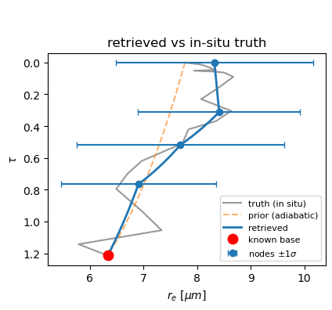
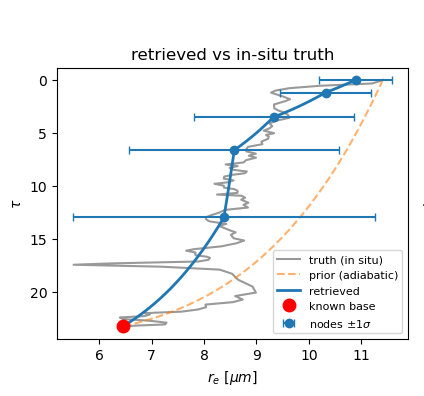

# pydisort_riccati_jax — differentiable RT solver for inhomogeneous atmospheres (WORK IN PROGRESS)

A JAX, fully differentiable forward solver for the 1-D radiative transfer equation in a
plane-parallel atmosphere with **continuously τ-varying** single-scattering albedo ω(τ) and
phase function p(τ; μ, φ). It returns the upwelling radiance field at the top of atmosphere
u⁺(τ=0, μ, φ) and is built to sit inside an iterative retrieval of the cloud effective-radius
profile rₑ(τ).

The solver integrates the **invariant-imbedding matrix Riccati equation** with diffrax's
adaptive **Kvaerno5/4** (L-stable ESDIRK). Differentiating the
forward model is free reverse-mode autodiff — no hand-derived adjoint.

> This project began as a fork of **PythonicDISORT** but is now its own solver. PythonicDISORT
> is used only as an external dependency (for `pydisort()` references and `subroutines`); its
> current home is https://github.com/LDEO-CREW/Pythonic-DISORT.

## The retrieval chain

```
rₑ(τ)  ──miejax_lite──▶  (ω(τ), p(τ; μ, φ))  ──pydisort_riccati_jax──▶  u⁺(τ=0, μ, φ)
   (Mie, differentiable)        (this solver)        (retrieval observable at ToA)
```

`miejax_lite` (a sibling package) is the differentiable Mie front-end supplying the optics, 
ported to JAX from [`miepython`](https://miepython.readthedocs.io/en/latest/).

## VOCALS-REx retrieval demo

Effective-radius profiles rₑ(τ) per [VOCALS-REx](https://doi.org/10.5194/acp-11-627-2011)
in-situ observations of marine stratocumulus (C-130 CDP probe), retrieved using multi-band (1.24 / 1.64 / 2.13 µm) multi-angle
satellite radiances with Gauss–Newton optimal estimation and autodiff Jacobians. Grey: in-situ
truth; blue: retrieved ±1σ; dashed orange: adiabatic prior; red dot: known cloud base.

<p align="center">

&nbsp;&nbsp;

</p>

**Left:** thin, near-adiabatic cloud (RF11, τ ≈ 1.2)
**Right:** thick, non-adiabatic cloud (RF03, τ ≈ 23)
See [`docs/riccati_solver_VOCALS_retrieval.ipynb`](docs/riccati_solver_VOCALS_retrieval.ipynb).

## Layout

| Path | What |
|---|---|
| `src/` | the solver — 3 modules (`pydisort_riccati_jax.py`, `_riccati_solver_jax.py`, `_solve_bc_riccati_jax.py`) |
| `tests/` | PyTest suite (float32 default + a `float64` opt-in partition) |
| `docs/riccati_solver.md`, `*.ipynb` | maintainer guide + intro / VOCALS-retrieval notebooks |
| `docs/DESIGN_DECISIONS.md` | **settled** design decisions and their rationale |
| `docs/OUTSTANDING.md` | **open** problems and decisions (read this before assuming a feature exists) |
| `report_riccati_solver.tex` | the formal report (math + design justification) |

## Install & test

Requires Python ≥ 3.11 with `numpy`, `scipy`, `jax`, `diffrax`, plus **PythonicDISORT** (for
test references). Optionally `pip install -e .` to expose the `src/` modules; the test suite
also adds them to `sys.path` via `tests/conftest.py`.

```bash
# float32 production suite (default)
cd tests && python -m pytest . -v

# float64 partition (tight tolerances / FD gradient checks; slow)
cd tests && PYDISORT_RICCATI_JAX_X64=1 python -m pytest -m float64 -v
```

## Status

Forward solver and retrieval loop work end-to-end: differentiable Mie optics → Riccati RT →
Gauss–Newton optimal estimation with autodiff Jacobians, validated on VOCALS-REx profiles
(see demo above). Delta-M scaling and Nakajima–Tanaka TMS correction are implemented (opt-in).
Open items are tracked in `docs/OUTSTANDING.md`. Contact: Dion Ho, dh3065@columbia.edu.

License: MIT (see `LICENSE.md`).
