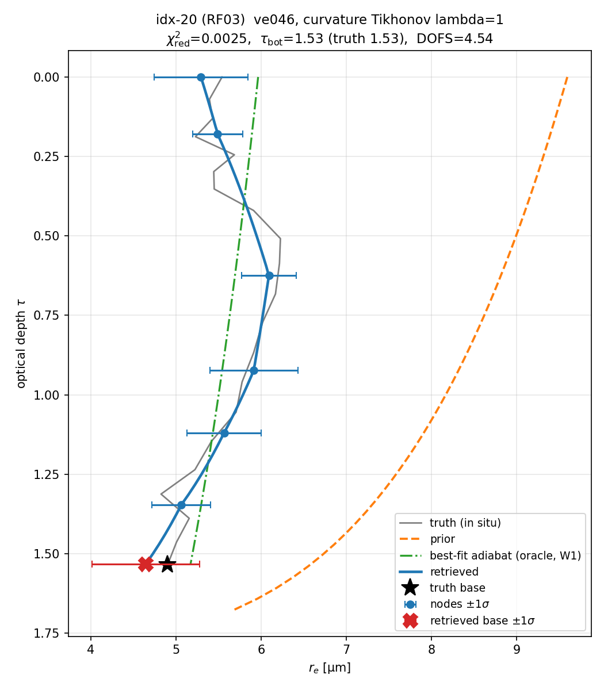
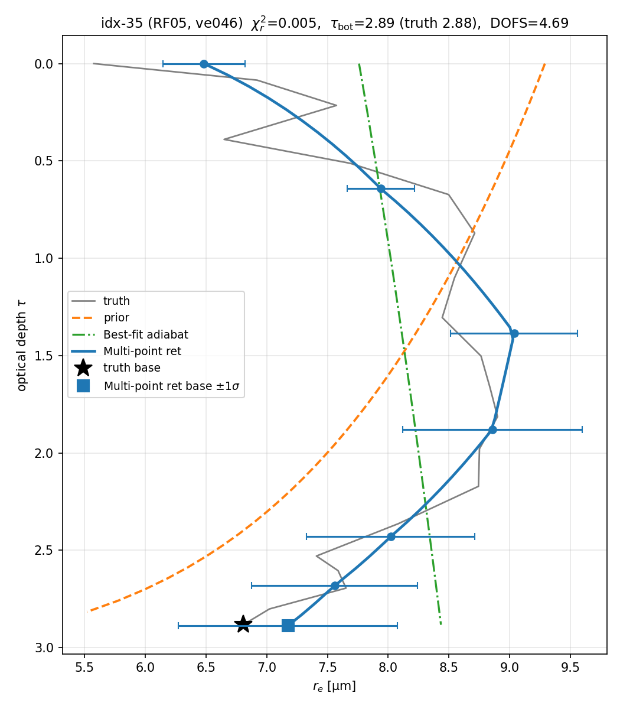

# pydisort_riccati_jax — differentiable RT solver for inhomogeneous atmospheres

A JAX, fully differentiable forward solver for the 1-D radiative transfer equation in a
plane-parallel atmosphere with **continuously τ-varying** single-scattering albedo ω(τ) and
phase function p(τ; μ, φ). It returns the upwelling radiance field at the top of atmosphere
u⁺(τ=0; μ, φ) and is built to sit inside an iterative retrieval of the cloud effective-radius
profile rₑ(τ).

The solver integrates the **invariant-imbedding matrix Riccati equation** with diffrax's
adaptive **Kvaerno5/4** (L-stable ESDIRK). Differentiating the
forward model is free reverse-mode autodiff — no hand-derived adjoint.

> This project began as a fork of **PythonicDISORT** but is now its own solver. PythonicDISORT
> is used only as an external dependency (for `pydisort()` references and `subroutines`); its
> current home is https://github.com/LDEO-CREW/Pythonic-DISORT.

## The retrieval chain

```
rₑ(τ)  ──optics_table──▶  (ω(τ), p(τ; μ, φ))  ──pydisort_riccati_jax──▶  u⁺(τ=0, μ, φ)
(Mie table, differentiable)      (this solver)             (retrieval observable at ToA)
```

`optics_table` builds a [`miepython`](https://miepython.readthedocs.io/en/latest/)-grounded,
gamma-averaged rₑ → (ω, Legendre) lookup table whose `table_lookup` is differentiable
(the earlier JAX-Mie front-end `miejax_lite` is retired; kept as a sibling package for legacy
validation only).

### When to use which solver

| | `PythonicDISORT.pydisort` | `pydisort_riccati_jax` |
|---|---|---|
| Atmosphere | piecewise-constant layers | **continuous** ω(τ), gₗ(τ) |
| Method | exact eigendecomposition (Stamnes–Conklin) | invariant-imbedding Riccati ODE (Kvaerno5) |
| Differentiable | via `autograd` (output funcs only) | **yes** — `jax.grad` through the whole solve |
| Output depths | any τ | ToA (τ=0) only |
| Best for | constant-property columns | τ-varying retrieval forward model |

For **constant** ω / phase function, prefer `pydisort` — it is exact and faster.

## VOCALS-REx retrieval demo

Effective-radius profiles rₑ(τ) per [VOCALS-REx](https://doi.org/10.5194/acp-11-627-2011)
in-situ observations of marine stratocumulus (C-130 CDP probe), retrieved from a multi-band
(10 shortwave/near-IR channels, 0.55–4.05 µm) multi-angle (24 view directions) satellite
observing system with Gauss–Newton optimal estimation and autodiff Jacobians.

<p align="center">

&nbsp;&nbsp;

</p>

The two clouds where the multi-point retrieval most **beats the truth-fed best-fit adiabat (green)**.
**Left:** RF03, τ ≈ 1.5 (−81 % in W₁ vs that best fit). **Right:**
RF05, τ ≈ 2.9 (−79 %). Full all-125 campaign (and the matched 2-point adiabatic-retrieval
comparison) in
[`docs/riccati_solver_VOCALS_retrieval.ipynb`](docs/riccati_solver_VOCALS_retrieval.ipynb), §16.

## Documentation

Two levels, mirroring PythonicDISORT's docs:

- **[User guide](docs/user_guide.ipynb)** — install and run: the forward solver,
  gradients/jit, Mie optics, an OE retrieval, information-content profiling, the
  HPC pipeline, troubleshooting. All code blocks executed.
- **[Comprehensive technical documentation](docs/technical_documentation.md)** —
  for scientists/mathematicians: governing equations, the invariant-imbedding
  Riccati formulation and its stability guarantee, delta-M/TMS, the integrator,
  differentiability, Mie optics, the full OE retrieval + information-content
  methodology, the OSSE rigor discipline, and references.

## Layout

| Path | What |
|---|---|
| `src/pydisort_riccati_jax/` | the package: solver (`solver.py` + kernels) and the retrieval stack (`retrieval_oe`, `optics_table`, `info_content`, `noise_model`, `vocals_io`, `osse_config`, `runtime_setup`, `reference`) |
| `scripts/` | worker/analysis entry points for the all-125 VOCALS OSSE runs |
| `tests/` | PyTest suite (float32 default + a `float64` opt-in partition) |
| `hpc/` | re-runnable HPC task specs, run strategy, rigor gates, Slurm drivers |
| `docs/riccati_solver_VOCALS_retrieval.ipynb` | VOCALS-retrieval notebook (solver tour, validation, and full retrieval) |
| `docs/DESIGN_DECISIONS.md` | **settled** design decisions and their rationale |
| `docs/OUTSTANDING.md` | **open** problems and decisions (read this before assuming a feature exists) |
| `docs/technical_documentation.md` | the comprehensive technical documentation (math + methodology) |

## Install & test

Requires Python ≥ 3.11 with `numpy`, `scipy`, `jax`, `diffrax`, and **PythonicDISORT** (a core
dependency: the solver uses its `subroutines`, and the tests use `pydisort()` as reference).
`pip install -e .` installs the package (`.[retrieval]` adds `netCDF4` + `miepython` for the
VOCALS workers); the test suite also adds `src/` to `sys.path` via `tests/conftest.py`.

```bash
# float32 production suite (default)
cd tests && python -m pytest . -v

# float64 partition (tight tolerances / FD gradient checks; slow)
cd tests && PYDISORT_RICCATI_JAX_X64=1 python -m pytest -m float64 -v
```

## Contact

Dion Ho, dh3065@columbia.edu.

License: MIT (see `LICENSE.md`).

This project has been assisted by Claude Opus 4.6 & 4.8 and Fable 5.
